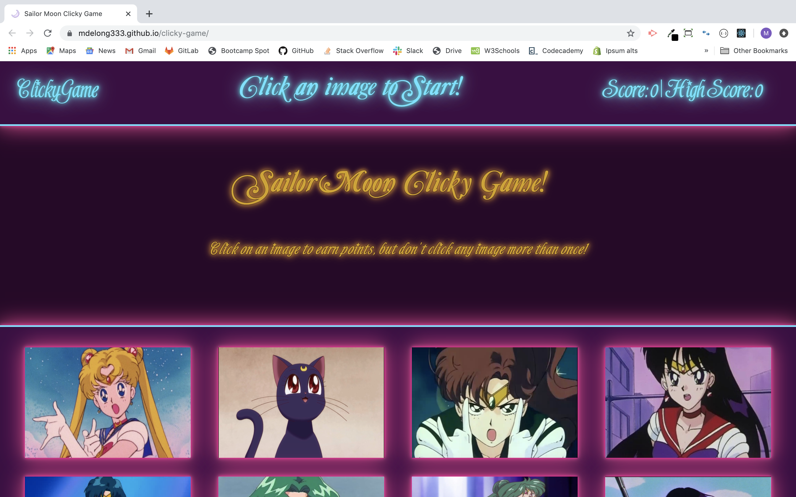

# Sailor Moon Clicky Game

## Overview
Sailor Moon Clicky Game is a memory game built using React. There are 12 Sailor Moon characters displayed, click each only once to win! With each correct click the characters will shuffle on the page. If you click the same character twice the game will restart.

 _**[Click here to play](https://mdelong333.github.io/clicky-game/)**_

 

 

## Tech Used

* React
* Javascript
* JSX
* Node
* Bootstrap